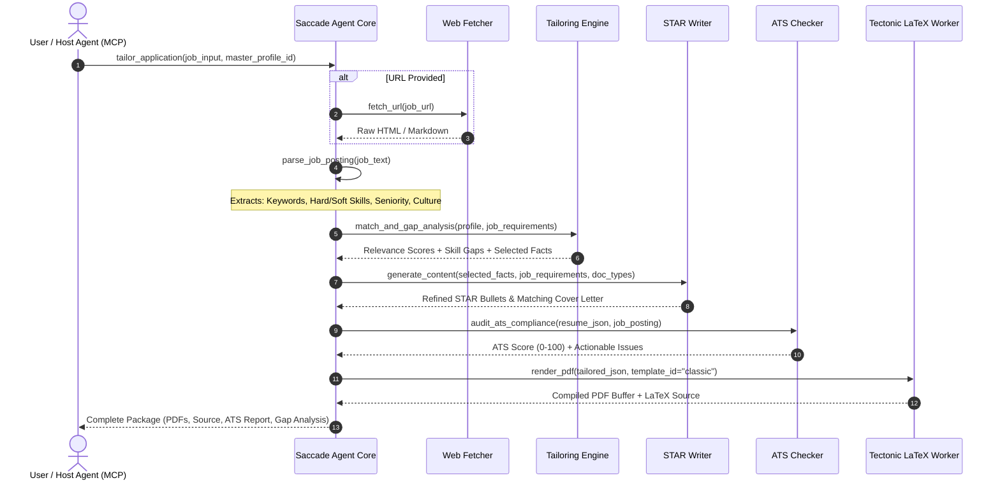
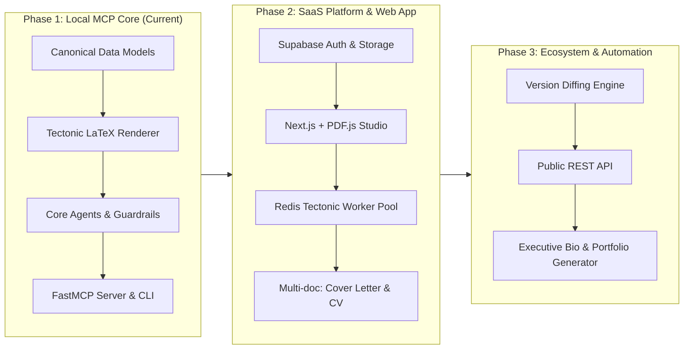

# Product Requirements Document (PRD)
## Saccade: AI-Powered LaTeX Platform for Resumes, CVs & Professional Documents

**Status:** Approved v2 (Revised & Production-Ready)  
**Project Codename:** `saccade`  
**Owner:** Engineering & Product Architecture  
**Target Repository:** `/home/a-n/Documents/BUSINESS/saccade`  
**Last Updated:** 2026-09-29  

---

## 1. Problem & Opportunity Analysis

### 1.1 The Market Paradox
Modern job applicants face an unbridgeable fragmentation across existing tooling:

| Category | Typical Tools | Strengths | Fatal Flaws |
| :--- | :--- | :--- | :--- |
| **Design-First** | Reactive Resume, Resume.io, Canva | Slick UI, drag-and-drop, quick onboarding | Not true LaTeX typography; AI is an afterthought/bolt-on; export layout shifts across PDF readers. |
| **AI-First** | Teal, Rezi, Kickresume, Jobscan | ATS keyword targeting, auto-tailoring | Closed-source lock-in; outputs look cookie-cutter; notorious for **hallucinating credentials/metrics** and generating bland corporate fluff. |
| **Typesetting-First** | RenderCV, Overleaf, LaTeX templates | Typographic perfection, micro-typography, version-controllable (Git) | High barrier to entry (raw LaTeX/CLI); zero native AI workflows; no ATS feedback loop; no centralized career graph. |

### 1.2 The Opportunity: The Saccade Thesis
**Saccade** bridges this trifecta: **LaTeX-grade micro-typography + Truth-anchored AI tailoring + Open Agent Core (MCP + Web)**.

Instead of writing a resume from scratch for each job, a professional maintains a single, verifiable **Canonical Career Graph**. When applying for a role, the autonomous agent pipeline parses the job description, performs a gap analysis, extracts the most impactful verified experiences from the career graph, refines the phrasing into high-impact STAR/XYZ bullets without inventing facts, verifies ATS parseability, and renders a publication-ready PDF via a high-performance LaTeX engine (Tectonic + RenderCV templating).

---

## 2. Core Goals & Non-Goals

### 2.1 Strategic Goals
1. **Zero-Hallucination Honesty Guarantee**: Every single AI-generated bullet point or statement must map via strict provenance IDs back to facts in the user's canonical profile. The AI reweights, reframes, and polishes—it never fabricates metrics, employers, dates, or titles.
2. **Typesetting Parity with Academic Standards**: 100% vector-sharp PDF generation using Tectonic LaTeX compilation and RenderCV-compatible themes. No browser `window.print()` or HTML-to-PDF hacks.
3. **Single Canonical Profile, Multi-Artifact Generation**: From one source of truth, generate tailored Resumes (1–2 pages), Academic CVs (multi-page), Cover Letters, LinkedIn Summaries, and Executive Bios.
4. **Decoupled Agent Architecture**: Every pipeline stage (Intake, Job Parsing, Tailoring, Writing, ATS Audit, LaTeX Render) is an independently callable, typed tool.
5. **Dual-Surface Distribution**:
   - **MCP Interface (Phase 1 Priority)**: Native integration with Claude Code, Cursor, Google Antigravity, and Claude Desktop via Model Context Protocol.
   - **Modern Web App (Phase 2)**: Next.js + Tailwind web application with side-by-side live PDF preview and chat-driven tailoring.

### 2.2 Non-Goals (v1 Scope Boundaries)
- **No Direct Job Scraping Bots**: No automated scraping of LinkedIn, Indeed, or login-gated portals that violates Terms of Service. Input is via direct user paste, clean public URL fetch, or official user data export.
- **No Automated Application Submission**: Saccade generates the highest-grade application materials; it does not execute automated form-filling or spam job boards.
- **No General-Purpose Document Editor**: Strictly scoped to professional career documents (Resumes, CVs, Cover Letters, Portfolios, Bios).

---

## 3. Product Principles

1. **One Source of Truth (Canonical Career Graph)**: Content lives in an extended JSON Resume schema. Artifacts are transient, deterministic projections of this graph tailored against a target specification.
2. **Cryptographic/Deterministic Fact Provenance**: AI tailoring functions as a compiler with strict type-checking against user truth. If the target job requires Kubernetes experience and the user profile lacks it, Saccade flags a **Gap Warning** rather than synthesizing fake Kubernetes experience.
3. **Separation of Content, Data, and Style**: Content is stored in semantic JSON. Design is expressed in declarative LaTeX Jinja2 templates. Changing a font, margin, or layout requires zero edits to career content.
4. **Open-Core & Self-Hostable**: The agent core, MCP server, and rendering pipeline are open source. The hosted SaaS provides authentication, managed Tectonic workers, document storage, and team sharing.
5. **Resilient LaTeX Compilation**: Automated sanitization of LaTeX reserved characters (`%`, `&`, `$`, `#`, `_`, `{`, `}`, `~`, `^`, `\`) with self-healing compile retries on engine errors.
6. **Multi-Model / BYOK & Privacy-First**: Complete provider agnosticism. Users and agents can use Anthropic (Claude 3.5 Sonnet/Haiku), OpenAI (GPT-4o), Google Gemini (2.5/3.x), or local private LLMs via Ollama / llama.cpp for zero-data-retention environments. Sensitive career PII never leaks to untrusted third parties.

---

## 4. User Personas & Primary Workflows

### 4.1 Personas
- **The Senior Engineer / Tech Leader**: Has 10+ years of dense experience. Needs aggressive filtering and role-focused reweighting (e.g., dialing Staff Eng vs. Eng Manager focus) without destroying typographic cleanliness.
- **The Career Transitioner**: Moving from one domain to another (e.g., Data Analyst to Product Manager). Needs intelligent framing of transferable skills while respecting historical veracity.
- **The Early Career / Graduate**: Has disparate projects, coursework, and internships. Needs unstructured notes turned into a structured profile and formatted to high academic standards.
- **The Academic / Researcher**: Needs dual output: a 1-page industry resume and a comprehensive 5+ page CV with publication citations and grant lists.

### 4.2 Primary Workflow (Job-Tailored Resume & Cover Letter)


---

## 5. Architectural Specification & Pipeline Tools

The Saccade engine is structured as modular, stateless functional tools coordinated by an orchestrator.

### 5.1 Tool Registry Contract

| Tool Name | Input Parameters | Output Payload | Description |
| :--- | :--- | :--- | :--- |
| `import_profile` | `raw_content: str`, `format: "pdf" \| "docx" \| "json" \| "notes"` | `ProfileSchema` | Ingests raw resume or notes and outputs canonical schema. |
| `parse_job_posting` | `source: str` (URL or raw text) | `JobPostingSchema` | Scrapes/normalizes posting, identifies requirements, level, keywords. |
| `tailor_profile` | `profile: ProfileSchema`, `job: JobPostingSchema`, `max_pages: int` | `TailoredProfileSchema`, `GapReport` | Weights and selects truthful experiences matching the target role. |
| `write_document_content` | `tailored: TailoredProfileSchema`, `doc_type: DocTypeEnum`, `tone: str` | `DocumentContentSchema` | Drafts targeted bullets, cover letters, or bios using XYZ formulas. |
| `audit_ats` | `document: DocumentContentSchema`, `job: JobPostingSchema` | `ATSReportSchema` | Scores keyword density, structural parsing risks, and missing terms. |
| `render_latex_pdf` | `document: DocumentContentSchema`, `theme: str`, `options: StyleOptions` | `pdf_bytes`, `latex_source`, `logs` | Compiles LaTeX template into production-grade vector PDF. |

### 5.2 The Honesty Guardrail Architecture
To guarantee zero-hallucination:
1. **Fact Decomposition**: During ingestion, every work experience is broken into atomic facts:
   - `Fact(id="f1", entity="Stripe", metric="45% latency reduction", action="rewrote caching layer in Redis")`.
2. **Constraint Verification**: The `write_document_content` agent receives strict instructions:
   - You may change sentence voice (e.g., active voice, strong action verbs).
   - You may emphasize aspects directly matching job keywords.
   - **Prohibited**: You must never introduce a tool, language, number, percentage, or currency not present in the fact set.
3. **AST Fact Checker (Post-generation verification)**: A secondary deterministic filter verifies that any named entities and quantities in the output exist in the source fact pool. Any bullet with unregistered claims is rejected and regenerated.

---

## 6. Data Model Specification

The data model extends the **JSON Resume standard (v1.0.0)** to support provenance tracking, multi-document generation, and ATS metadata.

```json
{
  "$schema": "https://jsonresume.org/schema/v1.0.0",
  "id": "usr_94820a1",
  "basics": {
    "name": "Alex Mercer",
    "label": "Staff Distributed Systems Engineer",
    "email": "alex@example.com",
    "phone": "+1-555-0199",
    "url": "https://alexmercer.dev",
    "summary": "Specializing in high-throughput consensus systems and real-time streaming architectures.",
    "location": { "city": "San Francisco", "region": "CA", "countryCode": "US" },
    "profiles": [
      { "network": "GitHub", "username": "alexmercer", "url": "https://github.com/alexmercer" },
      { "network": "LinkedIn", "username": "alex-mercer", "url": "https://linkedin.com/in/alex-mercer" }
    ]
  },
  "work": [
    {
      "id": "exp_stripe_01",
      "name": "Stripe",
      "position": "Senior Software Engineer",
      "url": "https://stripe.com",
      "startDate": "2021-03-01",
      "endDate": "2024-08-31",
      "summary": "Core Infrastructure team focusing on transaction routing.",
      "highlights": [
        "Architected multi-region failover pipeline reducing P99 latency by 35ms across 12B daily events.",
        "Led migration of ledger database from Aurora Postgres to distributed CockroachDB with zero downtime."
      ],
      "provenance": {
        "source": "uploaded_resume_2024.pdf",
        "verified": true,
        "atomic_facts": ["reduced P99 latency by 35ms", "12B daily events", "migrated Postgres to CockroachDB"]
      }
    }
  ],
  "education": [
    {
      "institution": "University of Washington",
      "area": "Computer Science",
      "studyType": "B.S.",
      "startDate": "2016-09-01",
      "endDate": "2020-06-15"
    }
  ],
  "skills": [
    {
      "name": "Distributed Systems",
      "level": "Master",
      "keywords": ["Raft", "Paxos", "Kafka", "gRPC", "Redis", "Rust", "Go"]
    }
  ],
  "custom_sections": {
    "publications": [],
    "patents": [],
    "grants": []
  },
  "applications": [
    {
      "id": "app_anthropic_01",
      "target_role": "Distributed Systems Engineer",
      "target_company": "Anthropic",
      "job_posting_ref": "job_anthropic_992",
      "created_at": "2026-09-29T12:00:00Z",
      "artifacts": {
        "resume_version": "v2",
        "cover_letter_version": "v1",
        "ats_score": 94
      }
    }
  ]
}
```

---

## 7. Technical Architecture & Implementation Stack

### 7.1 Tech Stack
- **Agent Core & Server**: Python 3.12+ with **FastAPI** and **FastMCP** (Official Model Context Protocol Python SDK).
- **Multi-Model / BYOK Layer**: Unified provider abstraction (`LiteLLM` / custom router) supporting Anthropic (Claude 3.5 Sonnet/Haiku), OpenAI (GPT-4o), Google Gemini (2.5/3.x Pro/Flash), and local Ollama (Llama 3, Mistral, Qwen) via `SACCADE_LLM_PROVIDER` and `--provider`.
- **LaTeX Templating**: **RenderCV** core engine + custom Jinja2 LaTeX themes.
- **LaTeX Compilation**: **Tectonic** (Modern self-contained TeX engine that compiles directly to PDF without requiring 4GB TeXLive installations) with standalone binary auto-provisioning.
- **Web Crawling / Job Fetching**: **httpx** + **trafilatura** / **BeautifulSoup4** with user-agent rotation and fallback markdown conversion.
- **Data Persistence**: Local JSON files (Phase 1) $\rightarrow$ **Supabase** (Postgres + pgvector + Row-Level Security in Phase 2).
- **Frontend (Phase 2)**: **Next.js 15 (App Router)** + **Tailwind CSS** + **PDF.js** rendering worker.
- **Async Queue (Phase 2)**: Redis + RQ or Celery for distributed compilation workers.

### 7.2 Directory Layout (`saccade`)
```text
/home/a-n/Documents/BUSINESS/saccade/
├── pyproject.toml              # Modern Python packaging (hatchling or poetry)
├── README.md                   # Quickstart and MCP configuration instructions
├── saccade/
│   ├── __init__.py
│   ├── cli.py                  # Direct CLI entrypoint: saccade tailor, saccade render
│   ├── mcp_server.py           # FastMCP server exposing all agent tools
│   ├── core/
│   │   ├── models.py           # Pydantic schemas (JSON Resume + extensions)
│   │   ├── llm.py              # Multi-model BYOK router (Anthropic, OpenAI, Gemini, Ollama)
│   │   ├── orchestrator.py     # End-to-end agent reasoning & coordination
│   │   └── guardrails.py       # Fact provenance & anti-hallucination verification
│   ├── agents/
│   │   ├── intake.py           # PDF/DOCX/Notes parser
│   │   ├── job_parser.py       # Web/text posting parser & requirement extractor
│   │   ├── tailor.py           # Relevance scoring & gap analyzer
│   │   ├── writer.py           # STAR/XYZ bullet & letter generator
│   │   └── ats_checker.py      # Format & keyword compliance auditor
│   ├── rendering/
│   │   ├── compiler.py         # Tectonic wrapper with error recovery & retry
│   │   ├── sanitizers.py       # LaTeX character escaping & syntax defense
│   │   └── templates/          # LaTeX Jinja2 themes
│   │       ├── classic/
│   │       ├── modern/
│   │       ├── executive/
│   │       └── academic_cv/
│   └── utils/
│       ├── web.py              # Clean URL content extractor
│       └── file_io.py
├── tests/
│   ├── test_guardrails.py
│   ├── test_compiler.py
│   ├── test_tailor.py
│   └── test_mcp_tools.py
└── examples/
    ├── master_profile.json
    └── sample_job_posting.txt
```

---

## 8. Detailed Roadmap & Phased Execution



### Phase 1: Local-First Core & MCP Server (Immediate Focus)
- [x] Architecture & PRD finalized.
- [ ] Implement canonical Pydantic models for Profile, JobPosting, ATSReport, and Documents.
- [ ] Build LaTeX rendering pipeline: Jinja2 template loader, character sanitizers, and direct Tectonic invocation.
- [ ] Package 3 core LaTeX themes: `classic` (clean serif/Overleaf style), `modern` (contemporary tech sans), `executive` (dense two-column/sidebar).
- [ ] Implement `agents/job_parser.py` (text and URL fetching via trafilatura).
- [ ] Implement `agents/tailor.py` and `agents/writer.py` with strict provenance validation.
- [ ] Implement `agents/ats_checker.py` (scoring keyword frequency, missing required skills, parsing risks).
- [ ] Expose all tools via `saccade/mcp_server.py` using `FastMCP`.
- [ ] Provide CLI for standalone local use (`saccade render`, `saccade tailor`).

### Phase 2: Web Application & Hosted Infrastructure
- Next.js 15 web application with dual-pane UI: Left pane chat/tailor controls, right pane real-time PDF canvas preview.
- Supabase backend for user accounts, encrypted document persistence, and team sharing.
- Distributed compilation worker pool using Redis + RQ for high-concurrency Tectonic rendering.
- Expanded document types: Cover Letters (synchronized LaTeX theme), Academic CVs, and LinkedIn About/Headlines.
- LinkedIn data export parser (`Profile.csv`, `Positions.csv`).

### Phase 3: Advanced Intelligence & Enterprise Extensibility
- Document versioning diff viewer (visual Git-style diff showing exactly what bullets changed across versions).
- Multi-language resume generation (maintaining professional translation consistency).
- Public REST API with API key provisioning and rate-limiting.

---

## 9. Success Metrics & Performance Benchmarks

1. **End-to-End Latency**:
   - Job Parsing + Tailoring + Writing: $< 12\text{ seconds}$.
   - Tectonic LaTeX Compilation: $< 1.5\text{ seconds}$ per document.
   - Total pipeline (Paste $\rightarrow$ PDF Download): $< 20\text{ seconds}$.
2. **Provenance & Honesty Rate**:
   - $\mathbf{100\%}$ adherence to source facts; $0$ unverified metrics accepted by guardrail.
3. **ATS Pass Benchmark**:
   - Automated parser test (standard ATS parsers like Sovren/Textkernel simulation) yielding $\ge 95\%$ extraction accuracy of dates, employers, titles, and skills.
4. **LaTeX Compile Reliability**:
   - $\ge 99.8\%$ successful first-pass compilation; $100\%$ success after automatic character sanitization retry.

---

## 10. Key Architectural Decisions & Resolved Questions

1. **Why Tectonic instead of standard TeXLive?**
   - TeXLive requires a 4GB+ Docker container and slow package management. Tectonic is a modern, memory-safe, Rust-based XeTeX engine that downloads packages on demand and compiles self-contained documents in hundreds of milliseconds.
2. **Why FastMCP as the first UI?**
   - Developers and knowledge workers already use Claude Code, Google Antigravity, and Cursor. An MCP server allows immediate real-world usage on day one without waiting for frontend/auth boilerplate to be completed.
3. **How does Saccade handle LaTeX compilation errors gracefully?**
   - The rendering engine runs a multi-stage sanitizer before passing input to Jinja2 templates, escaping dangerous TeX control sequences. If Tectonic exits with an error code, the log parser isolates the line number, applies a corrective fallback filter, and re-compiles automatically.
